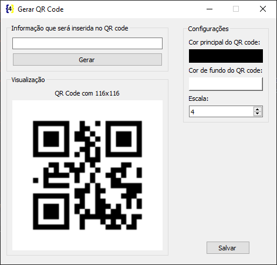

# PyQRCode GUI 

Pequena interface gráfica com PySide2 para facilitar a utilização o pacote [PyQRCode](https://pypi.org/project/PyQRCode/).



Executáveis gerados com [PyInstaller](https://www.pyinstaller.org/).

Linux:

```bash
pyinstaller -w -F --hidden-import PySide2.QtXml app.py
```

Windows:

```bash
pyinstaller -w -F --hidden-import PySide2.QtXml -i "assets/icons/icon.ico" app.py
```

macOS (Não testado):

```bash
pyinstaller -w -F --hidden-import PySide2.QtXml -i "assets/icons/icon.icns" app.py
```
